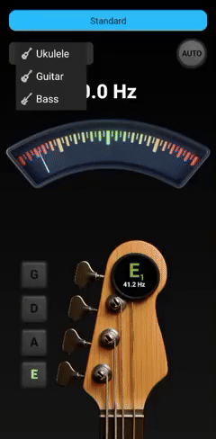
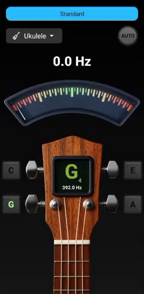

# 🎸 TuneSharper: A Multi-Instrument Tuner

TuneSharper is a responsive and easy-to-use tuner designed for guitar, ukulele, and bass.  
It combines real-time pitch detection, smooth visual feedback, and an optional auto-detection mode that identifies the closest string while playing.

---

## 🎬 Preview

  
  
  

---

## ⚡ Features

- Supports guitar, ukulele, and bass instruments
- Multiple built-in tuning profiles
- Auto-detection mode for identifying the nearest string
- Real-time pitch display with smooth needle animation
- Clean and minimal interface designed for quick tuning

---

## 📦 Download

The Android build is available in the **Releases** section.

1. Download the `.apk`
2. Install it on your device
3. Open TuneSharper and start tuning

---
